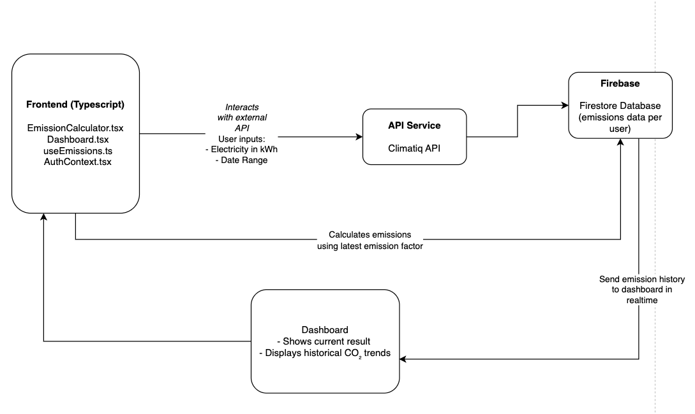

# 🌱 CO₂ Emissions Calculator – Conceptual Guide

## 1. Overview

The **CO₂ Emissions Calculator** is a responsive web application that helps users estimate and track their electricity-related carbon emissions over time. It fetches up-to-date emission factor data from the **Climatiq API**, calculates total emissions based on electricity usage (in kWh), and stores historical results in **Firebase** for personalized insights.

## 2. Key Concepts

- **Emission Factor**: A number (e.g., 0.5 kg CO₂/kWh) that quantifies how much CO₂ is produced per unit of activity (here: electricity use). These values vary by region and energy source.
- **kWh (kilowatt-hour)**: A standard measure of electricity use. The app uses this as user input to calculate emissions.
- **Time-based Tracking**: The user selects a **start and end date** to associate their energy usage with a specific period.

## 3. System Architecture Diagram

Here is a visual representation ofsystem architechture diagram

## 4. Component Responsibilities

| Module/File            | Responsibility                                                          |
|------------------------|--------------------------------------------------------------------------|
| `EmissionCalculator.tsx` | Multi-step form to collect user input (kWh, date range)                  |
| `Dashboard.tsx`         | Displays calculated emissions and historical data                        |
| `api.tsx`                | Interfaces with the Climatiq API to fetch emission factors and estimates |
| `useEmissions.ts`       | Custom hook to calculate, store, and fetch emission data                 |
| `emissionsService.ts`   | Firebase utility to store and retrieve emissions history                 |
| `App.tsx`               | Routing and global structure                                             |
| `AuthContext.tsx`       | Manages login/logout state (Google Auth)                                |

## 5. Workflow (User Journey)

1. **User logs in** with Google.
2. **Navigates to the Calculator**.
3. **Inputs electricity usage** (e.g., 300 kWh) and **date range** (e.g., April 1–30).
4. **App fetches emission factor** for German electricity from Climatiq.
5. **Total emissions are calculated** (e.g., 300 × 0.5 = 150 kg CO₂).
6. **Result is displayed** on the dashboard and **stored** in Firebase.
7. **User returns later** and sees a visual timeline of all past emissions.

